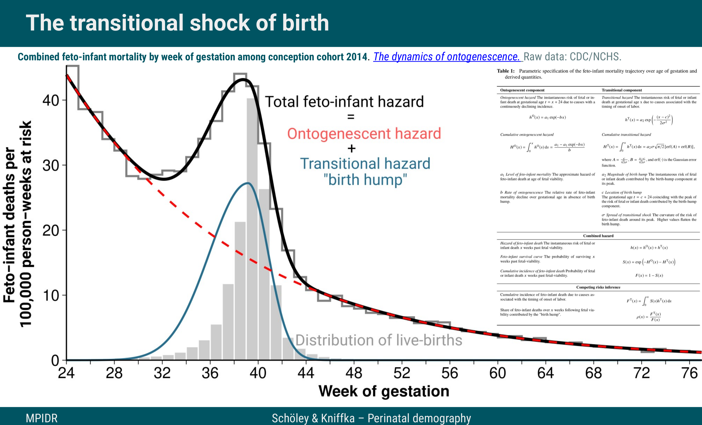

The “birth hump” – A shape decomposition of perinatal excess mortality
================
Jonas Schöley & Maxi Kniffka

*Presentation given at [PAA 2024](https://www.populationassociation.org/paa2024/home) in Columbus, USA.*

> We characterize the mortality pattern over gestational age for a cohort of fetuses as they pass the transition of birth. This transition leaves a mark on the mortality trajectory visible as a "birth-hump" – a temporary increase in the risk of either fetal or perinatal death centered around an age of 38 weeks of gestation. Using competing risks survival analysis, we exploit this pattern to quantify the risk of death contributed by the birth transition itself. 

